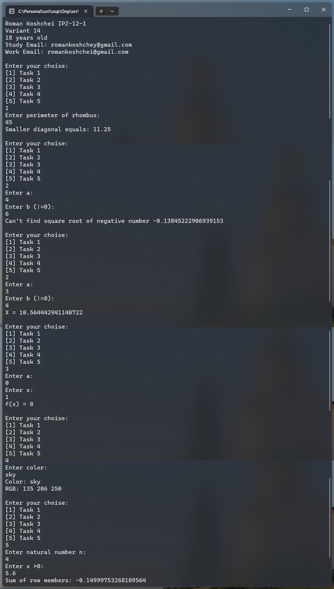

# Лабораторна робота №1

## Мета

- Ознайомитись з технологією створення консульних застосунків в IDE Visual
  Studio для використання виразів в арифметичних обчисленнях.
- Опанувати методи класу Console для консольного введення та виведення
  даних.
- Навчитись здійснювати перетворення типів даних в процесі їх консольного
  введення за допомогою методів класу Convert та з використанням методів
  Parse(), TryParse().
- Навчитись використовувати метод ToString() для перетворення об’єктів в
  його рядкове подання.

## Умова задачі

Створити консольний застосунок мовою C#. Вхідні дані ввести з
клавіатури. Результати вивести на консоль. Використати методи класів
Console, Convert в процесі введення та виведення даних. Реалізувати
перераховані завдання у вигляді методів класу Program. Виклик методів здійснити
за допомогою меню, застосувавши оператор вибору switch. Усі завдання варіанта
реалізувати в одному консольному проєкті Lab1.

### Завдання 1

Вивести на консоль власні анкетні дані: прізвище, ім'я, вік, група, курс,
e-mail. Висота ромба, проведена з вершини тупого кута, ділить
сторону навпіл. Знайдіть меншу діагональ, якщо значення периметра
ромба введене з клавіатури.

### Завдання 2

За даними, що введені з консолі, визначити значення виразу,
використовуючи математичні функції класу Math, і вивести результат
на консоль.

$$
x=e^a \sqrt{\frac{\sin a^2}{\ln (2+b)}}+\operatorname{tg} \frac{a}{b}
$$

### Завдання 3

За даними a, x, значення яких ввести з консолі, обчислити значення
функції:

$$
f(x)=\left\{\begin{array}{c}
-a x,-1 \leq x<1, a>0 \\
a-x, \quad x>1, a<0 \\
a / x, \quad x=1, a=0
\end{array}\right.
$$

### Завдання 4

Написати метод, який в залежності від назви кольору у спектрі
(червоний, помаранчевий, жовтий, зелений, блакитний, синій,
фіолетовий) виводить його порядковий номер і код RGB.

### Завдання 5

Дано натуральне число n і дійсне число x >0. Обчислити суму членів
ряду:

$$
S=\sum_{i=1}^n \frac{(-1)^i x^i}{(i+1)\left(1+x^i\right)}
$$

## Аналіз задачі

Треба створити 5 функцій для кожного завдання та Main для меню. В меню опції не будемо парсити в число дял простішого виконяння програми.

Інтерфейс буде на англійській мові, тож для 4-го завдання перекладемо назви кольорів на англійську.

Для парсингу чисел зі строки будемо використовувати `TryParse`, бо він не кидає помилки. Та ми конкретно можемо вказати, який параметер неправильно введено.

В 3-му завдянні використаємо новий `switch` з паттерн матчингом. Але також в коментаріях залишимо версію з `if`.

## Код програми

```cs
internal class Program
{
    private static void Main(string[] args)
    {
        Console.WriteLine("Roman Koshchei IPZ-12-1");
        Console.WriteLine("Variant 14");
        Console.WriteLine("18 years old");
        Console.WriteLine("Study Email: romankoshchey@gmail.com");
        Console.WriteLine("Work Email: romankoshchei@gmail.com");

        string? choise = "";
        while (choise != null)
        {
            Console.WriteLine();
            Console.WriteLine("Enter your choise:");
            Console.WriteLine("[1] Task 1");
            Console.WriteLine("[2] Task 2");
            Console.WriteLine("[3] Task 3");
            Console.WriteLine("[4] Task 4");
            Console.WriteLine("[5] Task 5");
            choise = Console.ReadLine()?.Trim();

            switch (choise)
            {
                case "1":
                    FindSmallerDiagonalRhombus();
                    break;

                case "2":
                    FindX();
                    break;

                case "3":
                    FindFX();
                    break;

                case "4":
                    ColorRgb();
                    break;

                case "5":
                    SumOfRowMembers();
                    break;

                default:
                    choise = null;
                    break;
            }
        }

        Console.WriteLine("Goodbye!");
    }

    private static void FindSmallerDiagonalRhombus()
    {
        Console.WriteLine("Enter perimeter of rhombus:");
        var perimeterStr = Console.ReadLine();

        if (!int.TryParse(perimeterStr, out var perimeter))
        {
            Console.WriteLine("Can't parse perimeter into a integer");
        }

        double side = perimeter / 4.0;
        Console.WriteLine($"Smaller diagonal equals: {side}");
    }

    private static void FindX()
    {
        Console.WriteLine("Enter a:");
        if (!double.TryParse(Console.ReadLine(), out var a))
        {
            Console.WriteLine("Can't parse 'a' into double");
        }

        Console.WriteLine("Enter b (!=0):");
        if (!double.TryParse(Console.ReadLine(), out var b))
        {
            Console.WriteLine("Can't parse 'b' into double");
        }
        if (b == 0)
        {
            Console.WriteLine("Can't divide by 0");
        }


        var x = Math.Pow(Math.E, a) * Math.Sqrt(Math.Sin(a * a) / Math.Log(2 + b)) + Math.Tan(a / b);
        Console.WriteLine($"X = {x}");
    }

    private static void FindFX()
    {
        Console.WriteLine("Enter a:");
        if (!double.TryParse(Console.ReadLine(), out var a))
        {
            Console.WriteLine("Can't parse 'a' into double");
        }

        Console.WriteLine("Enter x:");
        if (!double.TryParse(Console.ReadLine(), out var x))
        {
            Console.WriteLine("Can't parse 'x' into double");
        }

        // with pattern matching
        Console.WriteLine((x, a) switch
        {
            ( >= -1 and < 1, > 0) => $"f(x) = {-1 * a * x}",
            ( > 1, < 0) => $"f(x) = {a - x}",
            (1, 0) => $"f(x) = {a / x}",
            _ => "f(x) doesn't have a solution for given arguments"
        });

        // basic
        //if (x >= -1 && x < 1 && a > 0)
        //{
        //    Console.WriteLine($"f(x) = {-1 * a * x}");
        //    return;
        //}

        //if (x > 1 && a < 0)
        //{
        //    Console.WriteLine($"f(x) = {a - x}");
        //    return;
        //}

        //if (x == 1 && a == 0)
        //{
        //    Console.WriteLine($"f(x) = {a / x}");
        //    return;
        //}

        //Console.WriteLine("f(x) doesn't have a solution for given arguments");
    }

    private static readonly (string name, int r, int g, int b)[] supportedColors = [
        ("red", 255, 0, 0),
        ("orange", 255, 165, 0),
        ("yellow", 255, 255, 0),
        ("green", 0, 255, 0),
        ("blue", 0, 0, 255),
        ("sky", 135, 206, 250), // блакитний
        ("violet", 148, 0, 211),
    ];

    private static void ColorRgb()
    {
        Console.WriteLine("Enter color: ");
        var color = Console.ReadLine()?.ToLower().Trim();

        for (int i = 0; i < supportedColors.Length; i++)
        {
            var (name, r, g, b) = supportedColors[i];
            if (name == color)
            {
                Console.WriteLine($"Color: {color}");
                Console.WriteLine($"RGB: {r} {g} {b}");
                return;
            }
        }

        Console.WriteLine("Color wasn't found");
    }

    public static void SumOfRowMembers()
    {
        Console.WriteLine("Enter natural number n:");
        if (!int.TryParse(Console.ReadLine(), out var n) || n <= 0)
        {
            Console.WriteLine("Provided 'n' is not a possitive integer");
        }

        Console.WriteLine("Enter x >0:");
        if (!double.TryParse(Console.ReadLine(), out var x) || x <= 0)
        {
            Console.WriteLine("Provided 'x' is not a positive number");
        }

        double sum = 0;
        for (var i = 1; i <= n; i += 1)
        {
            // it's fine
            var top = Math.Pow(-1, i) * Math.Pow(x, i);
            var bottom = (i + 1) * (1 + Math.Pow(x, i));
            sum += top / bottom;
        }

        Console.WriteLine($"Sum of row members: {sum}");
    }
}
```

## Результат виконання програми



## Аналіз достовірності результатів

### Завдання 1

Якщо периметер ромба 45, сторона 45/4=11.25 і в нашому випадку сторона дорівеює меншій діагоналі.

### Завдання 2

$$
x=e^3 \sqrt{\frac{\sin 3^2}{\ln (2+4)}}+\operatorname{tg} \frac{3}{4}
$$

$$
x=e^3 \sqrt{\frac{\sin 9}{\ln (6)}}+\operatorname{tg} 0.75
$$

$$
x=e^3 \sqrt{\frac{0.41211848524175656975627256635244}{1.791759469228055000812477358380}}+ 0.93159645994407246116520275657394
$$

$$
x=e^3 * 0.47959118633647522826739870310809 + 0.93159645994407246116520275657394
$$

$$
x=9.6328464811966500935486897926842 + 0.93159645994407246116520275657394
$$

$$
x=10.564442941140722554713892549258
$$

Значення співпадає з результатами

### Завдання 3

a = 0
x = 1

f(x) = a / x = 0 / 1 = 0

Значення співпадає з результатами

### Завдання 4

Ми ввели `sky`, що є блакитний на англійській.Нам вивело RGB: 135 206 250.
Введемо ці значення в якусь палітру:


Вийшов блакитний.

### Завдання 5

n = 4
x = 5.6

a1 = ((-1)^1 \* 5.6^1) / ((1 + 1) \* (1 + 5.6^1))

a1 = (-5.6) / (13.2) = -0.42424242424242424242424

---

x^2 = 5.6^2 = 31.36

a2 = ((-1)^2 \* 5.6^2) / ((2 + 1) \* (1 + 5.6^2))

a2 = (31.36) / (97.08) = 0.32303255047383601153687

---

x^3 = 5.6^3 = 175.616

a3 = ((-1)^3 \* 5.6^3) / ((3 + 1) \* (1 + 5.6^3))

a3 = (-175.616) / (706.464) = -0.24858449970557593875979526203741

---

x^4 = 5.6^4 = 983.4496

a4 = ((-1)^4 \* 5.6^4) / ((4 + 1) \* (1 + 5.6^4))

a4 = (983.4496) / (4,922.248) = 0.1997968407930685329142294333808

---

S = -0.42424242424242424242424 + 0.32303255047383601153687 + (-0.24858449970557593875979526203741) + 0.1997968407930685329142294333808

S = -0.14999753268109563673293582865661

Значення співпадає з результатами.

## Висновки

Я можу створювати консольні програми для використання виразів при арифметичних обчисленнях, парсити різні типи даних з рядка.
