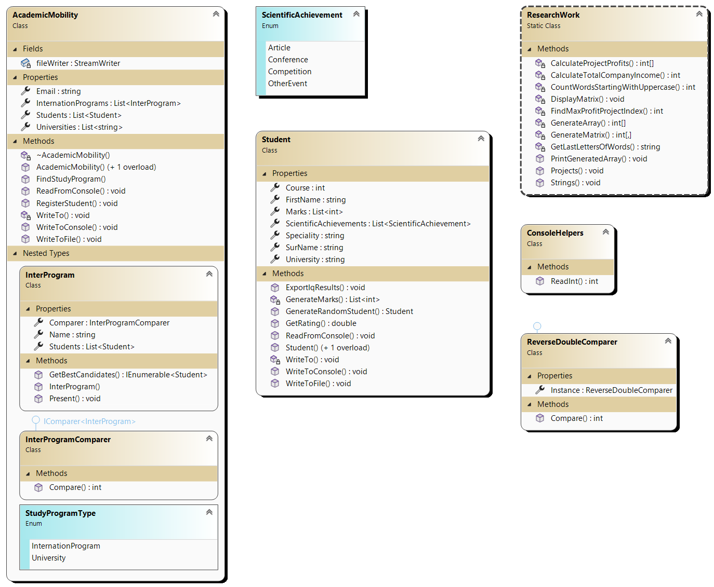

# Лабораторна робота №3

## Мета

1. Навчитись розробляти власні класи та використовувати їх у програмах.
2. Застосовувати конструктори класів для створення об’єктів.
3. Використовувати властивості (аксесори) класів для доступу до членів класу.
4. Опанувати технології вкладення класів і часткових класів і методів.
5. Навчитись використовувати статичні класи, поля та методи
6. Набути досвіду використання текстових файлів для збереження даних про
   об’єкти.

## Умова задачі

Розробити консольний застосунок мовою C# для обробки даних про
академічну мобільність студентів.

### Завдання 1

Створити класи Student (Студент) та AcademicMobility (відділ академічної
мобільності). Рекомендується кожний клас створювати в окремому файлі
командою Project → Add class
Визначити в класах закриті поля:
− клас Student: прізвище, ім’я, курс, назва спеціальності, назва
університету, рейтинг успішності, наукові здобутки;
− клас AcademicMobility: міжнародні програми, університети-партнери,
контакти

### Завдання 2

Визначити в класах конструктори без параметрів для ініціалізації полів
класів нульовими та пустими (для типу string) значеннями.

### Завдання 3

Визначити в класах конструктори з параметрами для ініціалізації полів
класів початковими значеннями.

### Завдання 4

Визначити в класах відкриті властивості (get, set) для доступу до закритих
полів та зміни значень ініціалізованих в конструкторах полів класів.

### Завдання 5

Визначити в класах відкриті методи для введення з консолі, виведення на
консоль значень ініціалізованих полів класу та запис значень до текстового
файлу.

### Завдання 6

Визначити в класах відкриті методи для роботи з об’єктами:

- клас Student:

  - Розрахунок рейтингу студенту як середній бал в сесії за 10
    дисциплінами. Оцінки студента генерувати псевдовипадковими
    цілими числами в діапазоні від 40 до 100. Включити до
    рейтингового балу бали за наукову діяльність студента (кількість
    статей – 5 балів за кожну статтю, участь в конференціях і конкурсах
    – по 4 бали за кожну подію тощо) та бали за знання іноземної мови.
  - Визначення IQ здібностей студента через проведення його
    тестування. Розробляти тестову систему не потрібно, потрібно
    здійснити імітацію визначення IQ студента із записом даних у
    текстовий файл.

- клас AcademicMobility:

  - Реєстрація студентів на програму міжнародної мобільності із
    записом даних про студентів у текстовий файл.
  - Пошук університету, який відповідає бажанням студента.
    Застосовувати метод бінарного пошуку в масиві рядків, якими є
    назви міжнародних програм та університетів.

### Завдання 7

Додати до класу AcademicMobility вбудований (вкладений) клас
InterProgram (міжнародні програми) з полями:

- Назва програми (подвійного диплому, DAAD, Fulbright тощо);
- Кількість студентів, які беруть участь у міжнародних програмах.
  та методами:
- Презентація міжнародних і стипендіальних програм в різних
  країнах;
- Проведення конкурсу серед претендентів на участь у міжнародних
  програмах (сортування студентів по рейтингах і вибір найкращих
  студентів).

### Завдання 8

Модифікувати клас AcademicMobility, подавши його як частковий, тобто
поділивши його на дві частини: в одну частину (окремий файл) включити
метод Презентація міжнародних і стипендіальних програм, в іншу (інший
файл) – метод Проведення конкурсу.

### Завдання 9

Додати до проекту новий статичний клас ResearchWork (наукова робота),
включивши в нього функції 2, 6, 9 з варіанта 3лабораторної роботи 2

## Аналіз задачі

Створимо класа з завдання, а також декілька додаткових, наприклад `ConsoleHelpers`.

## Діаграма

Проста діаграма:


Розширена діаграма:



## Код програми

Program.cs

```cs
using Lab3;

Console.WriteLine("Roman Koshchei IPZ-12-1");
Console.WriteLine("Variant 14");
Console.WriteLine("Study Email: romankoshchey@gmail.com");
Console.WriteLine("Work Email: romankoshchei@gmail.com");

var academicMobility = new AcademicMobility(
    "./academic-mobility.txt", "mobility@academic.com",
    [
        new("Erasmus Mundus Joint Master's Degree in Computer Vision and Robotics"),
        new("Fulbright Scholar Program"),
        new("Chevening Scholarship"),
        new("International Baccalaureate (IB) Program"),
        new("DAAD Scholarships"),
    ],
    [
        "Harvard University", "University of Oxford", "Stanford University",
        "ETH Zurich", "National University of Singapore"
    ],
    []
);

academicMobility.WriteToConsole();
academicMobility.WriteToFile();

Console.WriteLine();

var student = new Student();
student.ReadFromConsole();

Console.WriteLine();

Console.WriteLine("Student:");
student.WriteToConsole();

using var inputStudentFile = new StreamWriter("input-student.txt") { AutoFlush = true };
student.WriteToFile(inputStudentFile);

inputStudentFile.WriteLine("-----------------------");
student.ExportIqResults(inputStudentFile);

List<Student> students = [];
for (int i = 0; i < 10; i++)
{
    students.Add(Student.GenerateRandomStudent());
}

foreach (var person in students)
{
    academicMobility.RegisterStudent(person);
}

Console.WriteLine();

var studyProgram = academicMobility.FindStudyProgram("Chevening Scholarship");
if (studyProgram.HasValue)
{
    (var type, var index) = studyProgram.Value;
    Console.WriteLine("Chevening Scholarship exist");
    string typeStr = type switch
    {
        AcademicMobility.StudyProgramType.University => "University",
        _ => "International program"
    };
    Console.WriteLine($"It's a {typeStr}");
    Console.WriteLine($"Position is {index}");
}

var interProgram = academicMobility.InternationPrograms[0];
foreach (var person in students)
{
    interProgram.Students.Add(person);
}

interProgram.Present();
Console.WriteLine();

var best = interProgram.GetBestCandidates(5);
Console.WriteLine($"5 best students of {interProgram.Name} program:");
Console.WriteLine("-----------------------");
foreach (var person in best)
{
    person.WriteToConsole();
    Console.WriteLine("-----------------------");
}
Console.WriteLine();

ResearchWork.PrintGeneratedArray();

Console.WriteLine();

ResearchWork.Projects();

Console.WriteLine();

ResearchWork.Strings();
```

ConsoleHelpers.cs

```cs
namespace Lab3;

public class ConsoleHelpers
{
    public static int ReadInt(Func<int, bool> successCondition, string errorMessage)
    {
        var parsed = int.TryParse(Console.ReadLine(), out var value);
        while (!parsed || !successCondition(value))
        {
            Console.WriteLine(errorMessage);
            parsed = int.TryParse(Console.ReadLine(), out value);
        }
        return value;
    }
}
```

AcademicMobility.cs

```cs
namespace Lab3;

public partial class AcademicMobility
{
    /// <summary>
    /// Hold connection to the file where we will store Students
    /// </summary>
    private readonly StreamWriter fileWriter;

    public AcademicMobility()
    {
        Email = string.Empty;
        InternationPrograms = [];
        Universities = [];
        Students = [];
        fileWriter = new StreamWriter("academic-mobility.txt", true) { AutoFlush = true };
    }

    public AcademicMobility(
        string fileName,
        string email, List<InterProgram> internationPrograms,
        List<string> universities, List<Student> students
    )
    {
        fileWriter = new StreamWriter(fileName, true) { AutoFlush = true };
        Email = email;
        InternationPrograms = internationPrograms;
        Universities = universities;
        Students = students;
    }

    /// <summary>
    /// Don't forget to clean up file writer
    /// </summary>
    ~AcademicMobility()
    {
        if (fileWriter != null)
        {
            fileWriter.Close();
            fileWriter.Dispose();
        }
    }

    public enum StudyProgramType
    { InternationProgram, University };

    public string Email { get; set; }
    public List<InterProgram> InternationPrograms { get; set; }
    public List<Student> Students { get; set; }
    public List<string> Universities { get; set; }

    /// <returns>
    /// Type is eather international program or university
    /// and second element is index.
    /// </returns>
    public (StudyProgramType, int)? FindStudyProgram(string name)
    {
        Universities.Sort();
        var index = Universities.BinarySearch(name);
        if (index >= 0) return (StudyProgramType.University, index);

        InternationPrograms.Sort((x, y) => x.Name.CompareTo(y.Name));
        index = InternationPrograms.BinarySearch(new InterProgram(name), InterProgram.Comparer);
        if (index >= 0) return (StudyProgramType.InternationProgram, index);

        return null;
    }

    public void ReadFromConsole()
    {
        Console.WriteLine("Enter Email:");
        Email = Console.ReadLine() ?? string.Empty;

        Console.WriteLine("Enter Internation Programs count:");
        var count = ConsoleHelpers.ReadInt(
           value => value >= 0,
           "Count must be a non negative integener (>=0):"
       );

        InternationPrograms = new List<InterProgram>(count);
        for (int i = 0; i < count; i += 1)
        {
            Console.WriteLine($"Enter internation program {i + 1}:");
            InternationPrograms.Add(new(Console.ReadLine() ?? string.Empty));
        }

        Console.WriteLine("Enter Universities count:");
        count = ConsoleHelpers.ReadInt(
           value => value >= 0,
           "Count must be a non negative integener (>=0):"
       );

        Universities = new List<string>(count);
        for (int i = 0; i < count; i += 1)
        {
            Console.WriteLine($"Enter university {i + 1}:");
            Universities.Add(Console.ReadLine() ?? string.Empty);
        }
    }

    public void RegisterStudent(Student student)
    {
        Students.Add(student);
        student.WriteToFile(fileWriter);
        fileWriter.WriteLine("-----------------------");
    }

    public void WriteToConsole()
    {
        WriteTo(Console.WriteLine);
    }

    public void WriteToFile()
    {
        WriteTo(fileWriter.WriteLine);
    }

    /// <summary>
    /// Because we have the same output for Console and File.
    /// Let's just have 1 method that will write line by line into any source.
    /// </summary>
    private void WriteTo(Action<string> writeLine)
    {
        writeLine($"Email: {Email}");
        writeLine($"Internation programs:");
        foreach (var program in InternationPrograms)
        {
            writeLine($"- {program.Name}");
        }
        writeLine($"Universitiess:");
        foreach (var uni in Universities)
        {
            writeLine($"- {uni}");
        }
    }

    public partial class InterProgram
    {
        public IEnumerable<Student> GetBestCandidates(int limit)
        {
            return Students.OrderByDescending(x => x.GetRating()).Take(limit);
        }
    }
}
```

InterProgram.cs

```cs
namespace Lab3;

/// <summary>
/// Reverse comparison of double.
/// So sorting will be descending.
/// </summary>
public class ReverseDoubleComparer : IComparer<double>
{
    public static ReverseDoubleComparer Instance { get; } = new();

    public int Compare(double x, double y)
    {
        return y.CompareTo(x);
    }
}

public partial class AcademicMobility
{
    public partial class InterProgram
    {
        public InterProgram(string name)
        {
            Name = name;
        }

        public static InterProgramComparer Comparer { get; } = new InterProgramComparer();

        public string Name { get; set; }

        public List<Student> Students { get; set; } = [];

        public void Present()
        {
            Console.WriteLine($"International Program: {Name}");
            Console.WriteLine("Students:");
            Console.WriteLine("------------------------");
            foreach (Student student in Students)
            {
                student.WriteToConsole();
                Console.WriteLine("------------------------");
            }
        }
    }

    public class InterProgramComparer : IComparer<InterProgram>
    {
        public int Compare(InterProgram? x, InterProgram? y)
        {
            if (x == null && y == null) return 0;
            if (x == null) return -1;
            if (y == null) return 1;

            return x.Name.CompareTo(y.Name);
        }
    }
}
```

Student.cs

```cs
namespace Lab3;

public enum ScientificAchievement
{
    Article,
    Conference,
    Competition,
    OtherEvent
}

/// <summary>
/// Properties automatically create private fields during compilation.
/// </summary>
public class Student
{
    public string SurName { get; set; }
    public string FirstName { get; set; }
    public int Course { get; set; }
    public string Speciality { get; set; }
    public string University { get; set; }

    public List<int> Marks { get; set; }
    public List<ScientificAchievement> ScientificAchievements { get; set; }

    public Student()
    {
        SurName = string.Empty;
        FirstName = string.Empty;
        Course = 1;
        Speciality = string.Empty;
        University = string.Empty;
        Marks = GenerateMarks();
        ScientificAchievements = [];
    }

    /// <summary>
    /// Maybe need to check marks in future. That each mark is between 0 and 100.
    /// </summary>
    public Student(
        string surName, string firstName, int course, string speciality,
        string university, List<int> marks, List<ScientificAchievement> achievements
    )
    {
        SurName = surName;
        FirstName = firstName;
        Course = course;
        Speciality = speciality;
        University = university;
        Marks = marks;
        ScientificAchievements = achievements;
    }

    private static List<int> GenerateMarks()
    {
        const int count = 10;
        var rnd = new Random();
        var marks = new List<int>(count);
        for (int i = 0; i < count; i++)
        {
            marks.Add(rnd.Next(40, 101));
        }
        return marks;
    }

    public static Student GenerateRandomStudent()
    {
        Random random = new();

        string[] names = ["John", "Jane", "Alice", "Bob", "Eva", "Michael", "Olivia", "Daniel"];
        string[] universities = ["Harvard", "MIT", "Stanford", "Oxford", "ETH Zurich", "NUS"];
        string[] specialities = ["Computer Science", "Physics", "Engineering", "Biology", "Economics"];

        Student randomStudent = new()
        {
            SurName = names[random.Next(names.Length)],
            FirstName = names[random.Next(names.Length)],
            Course = random.Next(1, 6),
            Speciality = specialities[random.Next(specialities.Length)],
            University = universities[random.Next(universities.Length)],
            Marks = GenerateMarks()
        };

        // Generate random scientific achievements
        for (int i = 0; i < 3; i++)
        {
            randomStudent.ScientificAchievements.Add(
                (ScientificAchievement)random.Next(Enum.GetValues(typeof(ScientificAchievement)).Length)
            );
        }

        return randomStudent;
    }

    /// <summary>
    /// Maybe make static and return Student in future.
    /// </summary>
    public void ReadFromConsole()
    {
        Console.WriteLine("Enter SurName:");
        SurName = Console.ReadLine() ?? string.Empty;

        Console.WriteLine("Enter FirstName:");
        FirstName = Console.ReadLine() ?? string.Empty;

        Console.WriteLine("Enter Course:");
        Course = ConsoleHelpers.ReadInt(
           value => value > 0,
           "Course should be a positive integener (>0):"
       );

        Console.WriteLine("Enter Speciality:");
        Speciality = Console.ReadLine() ?? string.Empty;

        Console.WriteLine("Enter University:");
        University = Console.ReadLine() ?? string.Empty;

        Console.WriteLine("Enter Scientific Achievements count:");
        var count = ConsoleHelpers.ReadInt(
           value => value >= 0,
           "Count must be a non negative integener (>=0):"
       );

        Console.WriteLine("Scientific Achievements types:");
        Console.WriteLine("- [1] Article");
        Console.WriteLine("- [2] Conference");
        Console.WriteLine("- [3] Competition");
        Console.WriteLine("- [other] OtherEvent");

        ScientificAchievements = new(count);
        for (int i = 0; i < count; i += 1)
        {
            Console.WriteLine($"Enter scientific achievement {i + 1}:");
            var type = Console.ReadLine();
            ScientificAchievements.Add(type switch
            {
                "1" => ScientificAchievement.Article,
                "2" => ScientificAchievement.Conference,
                "3" => ScientificAchievement.Competition,
                _ => ScientificAchievement.OtherEvent,
            });
        }

        Console.WriteLine("Enter Marks count:");
        count = ConsoleHelpers.ReadInt(
            value => value >= 0,
            "Count must be a non negative integener (>=0):"
        );

        Marks = new(count);
        for (int i = 0; i < count; ++i)
        {
            var mark = ConsoleHelpers.ReadInt(
                value => value >= 0 && value <= 100,
                "Enter mark (>=0 and <=100):"
            );
            Marks.Add(mark);
        }
    }

    public double GetRating()
    {
        int sum = 0;
        foreach (var mark in Marks)
        {
            sum += mark;
        }
        double avg = sum / Marks.Count;

        foreach (var achivement in ScientificAchievements)
        {
            avg += achivement switch
            {
                ScientificAchievement.Article => 5,
                _ => 4
            };
        }
        return avg;
    }

    /// <summary>
    /// Let's assume that IQ is average mark.
    /// </summary>
    /// <param name="writer">Stream Writer of file</param>
    public void ExportIqResults(StreamWriter writer)
    {
        if (Marks.Count == 0) return;

        int sum = 0;
        foreach (var mark in Marks)
        {
            sum += mark;
        }
        double avg = sum / Marks.Count;

        writer.WriteLine($"Student: {SurName} {FirstName}");
        writer.WriteLine($"IQ: {avg}");
    }

    public void WriteToConsole()
    {
        WriteTo(Console.WriteLine);
    }

    /// <summary>
    /// Writing student info to file.
    /// </summary>
    /// <param name="writer">
    /// StreamWriter for file.
    /// It's better to not open file inside of logic method.
    /// Open file outside and then just pass stream.
    /// </param>
    public void WriteToFile(StreamWriter writer)
    {
        WriteTo(writer.WriteLine);
    }

    /// <summary>
    /// Because we have the same output for Console and File.
    /// Let's just have 1 method that will write line by line into any source.
    /// </summary>
    private void WriteTo(Action<string> writeLine)
    {
        writeLine($"SurName: {SurName}");
        writeLine($"FirstName: {FirstName}");
        writeLine($"Course: {Course}");
        writeLine($"Speciality: {Speciality}");
        writeLine($"University: {University}");
    }
}
```

ResearchWork.cs

```cs
namespace Lab3;

public static class ResearchWork
{
    public static void PrintGeneratedArray()
    {
        var arr = GenerateArray(20);
        Console.WriteLine($"Array size: {arr.Length}");
        for (int i = 0; i < arr.Length; i++)
        {
            Console.Write($"{arr[i]} ");
        }
        Console.WriteLine();
    }

    public static void Projects()
    {
        Console.WriteLine("Enter the number of projects (rows): ");
        int projectsCount = int.Parse(Console.ReadLine() ?? "1");

        Console.WriteLine("Enter the number of months (columns): ");
        int monthsCount = int.Parse(Console.ReadLine() ?? "1");

        Console.WriteLine("Enter the starting value of the range: ");
        int minValue = int.Parse(Console.ReadLine() ?? "0");

        Console.WriteLine("Enter the end value of the range: ");
        int maxValue = int.Parse(Console.ReadLine() ?? "0");

        int[,] matrix = GenerateMatrix(projectsCount, monthsCount, minValue, maxValue);
        Console.WriteLine("Matrix of profits from projects:");

        DisplayMatrix(matrix);

        int[] projectProfits = CalculateProjectProfits(matrix);
        int totalCompanyIncome = CalculateTotalCompanyIncome(matrix);
        int maxProfitProjectIndex = FindMaxProfitProjectIndex(projectProfits);

        Console.WriteLine("Total profit from each project:");
        for (int i = 0; i < projectProfits.Length; i++)
        {
            Console.WriteLine($"Project {i + 1}: {projectProfits[i]}");
        }

        Console.WriteLine($"The company's total revenue for all months: {totalCompanyIncome}");
        Console.WriteLine($"Index of the project with the highest profit: {maxProfitProjectIndex + 1}");
    }

    public static void Strings()
    {
        Console.Write("Enter a string of characters: ");
        string inputString = Console.ReadLine() ?? "";

        int wordsStartingWithUppercaseCount = CountWordsStartingWithUppercase(inputString);

        Console.WriteLine($"Number of words starting with a capital letter: {wordsStartingWithUppercaseCount}");

        string resultText = GetLastLettersOfWords(inputString);
        Console.WriteLine($"Text composed of the last letters of all words: {resultText}");
    }

    private static int[] CalculateProjectProfits(int[,] matrix)
    {
        int rows = matrix.GetLength(0);
        int columns = matrix.GetLength(1);
        int[] projectProfits = new int[rows];

        for (int i = 0; i < rows; i++)
        {
            for (int j = 0; j < columns; j++)
            {
                projectProfits[i] += matrix[i, j];
            }
        }

        return projectProfits;
    }

    private static int CalculateTotalCompanyIncome(int[,] matrix)
    {
        int rows = matrix.GetLength(0);
        int columns = matrix.GetLength(1);
        int totalCompanyIncome = 0;

        for (int i = 0; i < rows; i++)
        {
            for (int j = 0; j < columns; j++)
            {
                totalCompanyIncome += matrix[i, j];
            }
        }

        return totalCompanyIncome;
    }

    private static int CountWordsStartingWithUppercase(string input)
    {
        return input
            .Split(' ')
            .Count(word => !string.IsNullOrEmpty(word) && char.IsUpper(word[0]));
    }

    private static void DisplayMatrix(int[,] matrix)
    {
        int rows = matrix.GetLength(0);
        int columns = matrix.GetLength(1);

        for (int i = 0; i < rows; i++)
        {
            for (int j = 0; j < columns; j++)
            {
                Console.Write($"{matrix[i, j],5}");
            }
            Console.WriteLine();
        }
    }

    private static int FindMaxProfitProjectIndex(int[] projectProfits)
    {
        int maxProfit = int.MinValue;
        int maxProfitIndex = -1;

        for (int i = 0; i < projectProfits.Length; i++)
        {
            if (projectProfits[i] > maxProfit)
            {
                maxProfit = projectProfits[i];
                maxProfitIndex = i;
            }
        }

        return maxProfitIndex;
    }

    private static int[] GenerateArray(int size)
    {
        Random random = new();
        int[] array = new int[size];
        for (int i = 0; i < size; i += 1)
        {
            array[i] = random.Next(1, 100);
        }
        return array;
    }

    private static int[,] GenerateMatrix(int rows, int columns, int minValue, int maxValue)
    {
        if (maxValue < minValue)
        {
            (minValue, maxValue) = (maxValue, minValue);
        }

        Random random = new();
        int[,] matrix = new int[rows, columns];

        for (int i = 0; i < rows; i++)
        {
            for (int j = 0; j < columns; j++)
            {
                matrix[i, j] = random.Next(minValue, maxValue + 1);
            }
        }

        return matrix;
    }

    private static string GetLastLettersOfWords(string input)
    {
        return string.Join("",
            input.Split(' ')
            .Where(word => !string.IsNullOrEmpty(word))
            .Select(word => word.Last())
        );
    }
}
```

## Результат виконання програми


## Аналіз достовірності результатів

Після написання програми я протестував та знайшов декілька місць для покращення коду.
Саме через це у папці в Гугл Диску є версія 2.
Все працює так, як і має бути, дивіться результати.

## Висновки

Я навчився створювати класи, а також працювати с файлами.
Дізнався, що по замовчуванню `StreamWriter` не постійно пише в файл.
