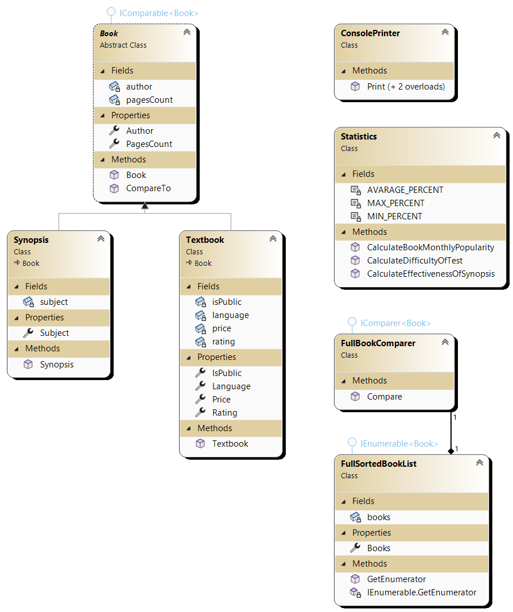
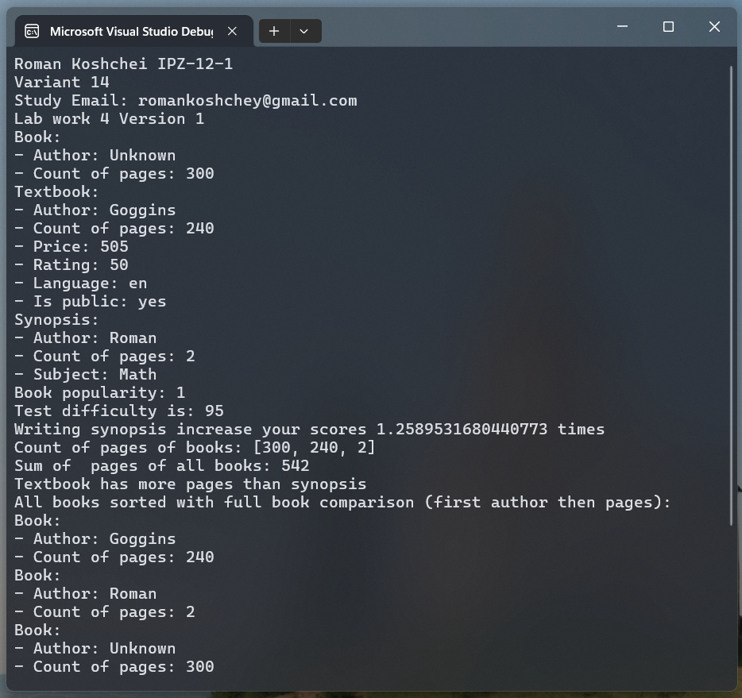

# Лабораторна робота №4

## Мета

1. Ознайомитися з принципом спадкування класів.
2. Навчитись використовувати конструктори базових та похідних класів.
3. Набути досвіду будувати ієрархію класів для повторного використання коду.
4. Опанувати посилальний тип інтерфейсу. Навчитись використовувати
   стандартні інтерфейси C#.
5. Ознайомитися з абстрактними класами C#.

## Умова задачі

1. Створити консольний застосунок мовою C# для роботи з ієрархією класів, що
   включає базовий клас Книга та похідні класи Підручник, Конспект. Задати
   закриті загальні поля у базовому класі (назва, вартість) і закриті специфічні
   поля в похідних класах (автор книги чи ім’я студента для конспекту, кількість
   сторінок, рейтинг популярності, мова, вільний доступ), реалізувати такі
   відкриті методи класів:
2. Конструктор базового класу (без параметрів або з параметрами) для
   ініціалізації полів класу Книга.
3. Конструктори похідних класів (з параметрами) для ініціалізації полів похідних
   класів.
4. Методи –аксесори (властивості) для доступу до закритих полів класів.
5. Методи виведення значень полів класів на консоль.
6. Методи, що розраховують рейтинг популярності книги (статус бестселера) в
   залежності від обсягу продажів за тиждень, місяць; складність розрахункових
   завдань і тестів в залежності від кількості студентів, що їх розв’язують,
   ефективність ведення конспекту студентом в залежності від кількості
   інформації, що запам’ятовується та усвідомлюється під час конспектування.
7. Розробити другу версію консольного застосунку, що реалізує ієрархію класів
   у вигляді інтерфейсу, від якого успадковується похідний клас Книга, від якого
   успадковуються класи Підручник, Конспект. Продемонструвати доступ до
   методів, що реалізовані в похідних класах через посилання на інтерфейс.
8. Розробити третю версію консольного застосунку, що реалізує ієрархію класів
   у вигляді абстрактного базового класу Книга, від якого успадковуються класи
   Підручник, Конспект. Протестувати відмінності застосування інтерфейсів і
   абстрактних класів.
9. Розробити нову версію консольного застосунку, в якій створити масив об'єктів
   класу Книга. В класі реалізувати:
   − інтерфейс IComparable для порівняння книг за ціною в методі CompareTo()
   − інтерфейс IComparer для порівняння книг за ціною і за кількістю сторінок
   − інтерфейс IEnumerable для виведення на консоль списку книг,
   впорядкований за ціною і за кількістю сторінок

## Аналіз задачі

Функціональність виведення в консоль помістимо в окремий класс `ConsolePrinter`.

В базовому классі `Book` замінимо вартість на кіл-ть сторінок, а назву на автора.
Бо конспект не має ціни та назви.

Методи для завдання 6 винесемо в окремий класс `Statistics`. Й через те, що він не містить стану, то методи будуть статичними. Це так званий "логічний модуль".

## Діаграма



## Код програми

Program.cs

```cs
using Lab4V4;

Console.WriteLine("Roman Koshchei IPZ-12-1");
Console.WriteLine("Variant 14");
Console.WriteLine("Study Email: romankoshchey@gmail.com");
Console.WriteLine("Lab work 4 Version 1");

// Book is abstract so we can't create instance of it
// Only instance of child
Book book = new Textbook("Unknown", 230, 300);
// Print will output only fields of Book class
// Because we casted Textbook to Book
ConsolePrinter.Print(book);

var textbook = new Textbook("Goggins", 505, 240);
ConsolePrinter.Print(textbook);

var synopsis = new Synopsis("Math", "Roman", 2);
ConsolePrinter.Print(synopsis);

var bookPopularity = Statistics.CalculateBookMonthlyPopularity(book, [
    new Statistics.BookSales(book, 789),
    new Statistics.BookSales(textbook, 204),
    new Statistics.BookSales(new Textbook("Martin", 700, 700), 1250),
]);
Console.WriteLine($"Book popularity: {bookPopularity}");

var testDifficulty = Statistics.CalculateDifficultyOfTest(45, 23);
Console.WriteLine($"Test difficulty is: {testDifficulty}");

var synopsisEffectiveness = Statistics.CalculateEffectivenessOfSynopsis(
    [45, 23, 56, 90, 93, 56], [87, 75, 23, 90, 95, 87]
);
Console.WriteLine($"Writing synopsis increase your scores {synopsisEffectiveness} times");

Book[] allBooksTogether = [book, textbook, synopsis];
Console.Write("Count of pages of books: ");
Console.WriteLine($"[{string.Join(", ", allBooksTogether.Select(x => x.PagesCount.ToString()))}]");
Console.WriteLine($"Sum of  pages of all books: {allBooksTogether.Sum(x => x.PagesCount)}");

int comparison = textbook.CompareTo(synopsis);
Console.WriteLine(comparison switch
{
    < 0 => "Textbook has less pages than synopsis",
    0 => "Textbook has equale count of pages as the synopsis",
    > 0 => "Textbook has more pages than synopsis"
});

FullSortedBookList sorted = new();
foreach (var item in allBooksTogether)
{
    sorted.Books.Add(item);
}

Console.WriteLine("All books sorted with full book comparison (first author then pages):");
foreach (var item in sorted)
{
    ConsolePrinter.Print(item);
}
```

Book.cs

```cs
namespace Lab4V4;

/// <summary>
/// Book has fields: author and pagesCount
/// Because pricing and name is specific and don't appear in Synopsis
/// </summary>
public abstract class Book : IComparable<Book>
{
    private string author;
    private uint pagesCount;

    public Book(string author, uint pagesCount)
    {
        this.author = author;
        this.pagesCount = pagesCount;
    }

    public string Author { get => author; set => author = value; }
    public uint PagesCount { get => pagesCount; set => pagesCount = value; }

    public int CompareTo(Book? other)
    {
        if (other == null) return 1;
        return pagesCount.CompareTo(other.pagesCount);
    }
}

public class FullBookComparer : IComparer<Book>
{
    public int Compare(Book? x, Book? y)
    {
        if (x == null && y == null) return 0;
        else if (x == null) return -1;
        else if (y == null) return 1;

        int authorComparison = string.Compare(x.Author, y.Author, StringComparison.Ordinal);
        if (authorComparison != 0) return authorComparison;

        return x.PagesCount.CompareTo(y.PagesCount);
    }
}
```

Synopsis.cs

```cs
namespace Lab4V4;

public class Synopsis : Book
{
    private string subject;

    public Synopsis(string subject, string author, uint pagesCount) : base(author, pagesCount)
    {
        this.subject = subject;
    }

    public string Subject { get => subject; set => subject = value; }
}
```

Textbook.cs

```cs
namespace Lab4V4;

public class Textbook : Book
{
    private uint price;
    private uint rating;
    private string language;
    private bool isPublic;

    public Textbook(string author, uint price, uint pagesCount) : base(author, pagesCount)
    {
        this.price = price;
        rating = 50;
        language = "en";
        isPublic = true;
    }

    public uint Price { get => price; set => price = value; }
    public uint Rating { get => rating; set => rating = value; }
    public string Language { get => language; set => language = value; }
    public bool IsPublic { get => isPublic; set => isPublic = value; }
}
```

Statistics.cs

```cs
namespace Lab4V4;

/// <summary>
/// Class contains different methods to calculatet statistics.
/// Methods are static, because the class doesn't hold any state.
/// </summary>
public class Statistics
{
    public record BookSales(Book Book, uint SalesCount);

    private const uint AVARAGE_PERCENT = 50;
    private const uint MAX_PERCENT = 100;
    private const uint MIN_PERCENT = 0;

    /// <summary>
    /// Calculate rating of a particular book based on monthly sales.
    /// Rating is relative to other books.
    /// </summary>
    /// <param name="book">Book for which we calculate rating</param>
    /// <param name="sales">List of all book sold in the month</param>
    /// <returns>Popularity rating from 0 to 100</returns>
    public static uint CalculateBookMonthlyPopularity(Book book, List<BookSales> sales)
    {
        var avarageSales = sales.Average(s => s.SalesCount);
        if (avarageSales == 0) return AVARAGE_PERCENT;

        var bookSales = sales.FirstOrDefault(x => x.Book.Equals(book));
        if (bookSales == null) return MIN_PERCENT;

        double popularity = 0.01 * AVARAGE_PERCENT * bookSales.SalesCount / avarageSales;

        uint rounded = (uint)Math.Round(popularity);
        if (rounded > MAX_PERCENT) return MAX_PERCENT;
        if (rounded < MIN_PERCENT) return MIN_PERCENT;
        return rounded;
    }

    /// <summary>
    /// Calculate percent difficulty of a particular test.
    /// Based on count of students that passed.
    /// </summary>
    /// <param name="allStudents">Count of all students that took the test</param>
    /// <param name="studentsThatSolved">Count of students that solved the test</param>
    /// <returns></returns>
    public static uint CalculateDifficultyOfTest(uint allStudents, uint studentsThatSolved)
    {
        var passedPercent = MAX_PERCENT * studentsThatSolved * 0.1 / allStudents;

        var difficulty = MAX_PERCENT - passedPercent;

        uint rounded = (uint)Math.Round(difficulty);
        if (rounded > MAX_PERCENT) return MAX_PERCENT;
        if (rounded < MIN_PERCENT) return MIN_PERCENT;

        return rounded;
    }

    /// <summary>
    /// Calculates effectiveness of writing synopsis based on tests scores.
    /// </summary>
    /// <param name="scoresWithoutSynopsis">List of scores (from 0% to 100%) without writing synopsis</param>
    /// <param name="scoresWithSynopsis">List of scores (from 0% to 100%) with writing synopsis</param>
    /// <returns>Number in how much times with synopsis studend score more than without</returns>
    public static double CalculateEffectivenessOfSynopsis(List<uint> scoresWithoutSynopsis, List<uint> scoresWithSynopsis)
    {
        var withoutSynopsisAvg = scoresWithoutSynopsis.Average(x => x);
        var withSynopsisAvg = scoresWithSynopsis.Average(x => x);
        return withSynopsisAvg / withoutSynopsisAvg;
    }
}
```

FullSortedBookList.cs

```cs
using System.Collections;

namespace Lab4V4;

/// <summary>
/// List of books that are sorted with FullBookComparer in priority:
/// 1. by author
/// 2. by pages count
/// </summary>
public class FullSortedBookList : IEnumerable<Book>
{
    private readonly SortedSet<Book> books = new(new FullBookComparer());

    public SortedSet<Book> Books { get => books; }

    public IEnumerator<Book> GetEnumerator() => books.GetEnumerator();

    IEnumerator IEnumerable.GetEnumerator() => GetEnumerator();
}
```

ConsolePrinter.cs

```cs
namespace Lab4V4;

/// <summary>
/// Prints information about classes into Console
/// </summary>
public class ConsolePrinter
{
    public static void Print(Book book)
    {
        Console.WriteLine("Book:");
        Console.WriteLine($"- Author: {book.Author}");
        Console.WriteLine($"- Count of pages: {book.PagesCount}");
    }

    public static void Print(Textbook textbook)
    {
        Console.WriteLine("Textbook:");
        Console.WriteLine($"- Author: {textbook.Author}");
        Console.WriteLine($"- Count of pages: {textbook.PagesCount}");
        Console.WriteLine($"- Price: {textbook.Price}");
        Console.WriteLine($"- Rating: {textbook.Rating}");
        Console.WriteLine($"- Language: {textbook.Language}");
        var publicStatus = textbook.IsPublic ? "yes" : "no";
        Console.WriteLine($"- Is public: {publicStatus}");
    }

    public static void Print(Synopsis synopsis)
    {
        Console.WriteLine("Synopsis:");
        Console.WriteLine($"- Author: {synopsis.Author}");
        Console.WriteLine($"- Count of pages: {synopsis.PagesCount}");
        Console.WriteLine($"- Subject: {synopsis.Subject}");
    }
}
```

## Результат виконання програми

Результат:



## Висновки

Наслідування є не бажаним в більшості випадків.
Використання інтерфейсів надає більшу гручкість прогрмали, але інколи вимагає написання більшої кіл-ті коду.

В принціпі для використання схожаго функціоналу замість наслідування можна просто використовувати окремий класс, та зберігати його як поле.
