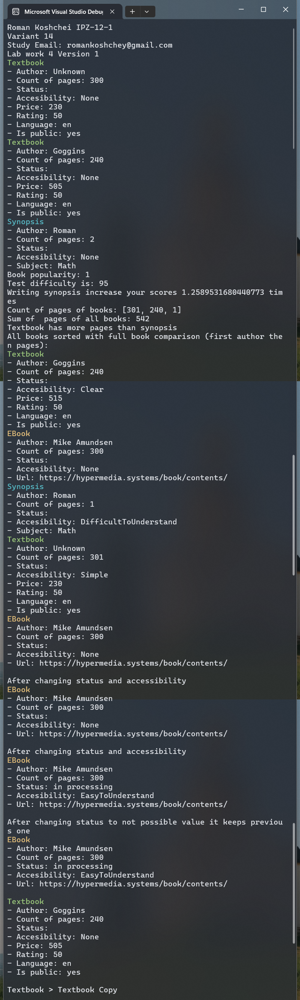

# Лабораторна робота №5

## Мета

1. Навчитися використовувати перевантажені методи і операції (поліморфізм
   методів і операцій).
2. Опанувати механізм віртуальних функцій
3. Набути досвіду застосування індексаторів для колекцій об’єктів

## Умова задачі

Створити новий консольний застосунок мовою C# шляхом модифікації
програми лабораторної роботи №4 в такий спосіб:

1. В ієрархію класів Книга (базовий клас), Підручник, Конспект (похідні
   класи) додати похідний клас Електронна_книга. Задати закриті
   специфічні поля в новому похідному класі та реалізувати такі відкриті
   методи класів:
2. Перевантажити конструктори у всіх класах, передбачивши по 3
   конструктори: за замовчуванням (без параметрів з ініціалізацією
   значень полів за замовчуванням), конструктор з параметрами для
   ініціалізації полів класів значеннями аргументів, конструктор для
   введення значень полів класу з клавіатури або копіювання об’єктів.
3. У кожному похідному класі, додатково до створених раніше методів,
   перевантажити методи, які визначають доступність матеріалу та статус
   підручника, конспекту та електронної книжки. Статус підручника
   означає надання грифу «рекомендовано» чи «затверджено», статус
   конспекту – відсутній, статус електронної книги: «опубліковано»,
   «завантажено», «в обробці», «знята з публікації». Доступність
   матеріалу кодувати цифрами, наприклад, «легка для розуміння»,
   «важка для розуміння», «проста», «чіткість» тощо. Для перевантаження
   використати віртуальні функції в базовому класі та override функції в
   похідних.
4. У кожному похідному класі перевантажити методи, які визначають
   рейтинг підручника, конспекту та електронної книжки з погляду
   студента. Врахувати такі показники, як актуальність і сучасність,
   доступність матеріалу для опанування, наявність практичних вправ і
   задач з відповідями, розвиток логічного мислення, відгуки в Інтернет.
   Алгоритм визначення рейтингу визначити самостійно. Для
   перевантаження використати віртуальні функції в базовому класі та
   override функції в похідних.
5. У похідних класах створити функцію для перевантаження бінарних
   операторів (+, -, ==, !=, >, < ), наприклад, порівняння рейтингів
   підручників, конспектів, електронної книжки, збільшення (зменшення)
   вартості книги в залежності від її рейтингу.
6. У похідних класах створити функцію для перевантаження унарних
   операторів (++, -, -- ), наприклад, збільшення (зменшення) рейтингу
   книги в залежності від кількості скачувань для електронної книжки,
   кількості позитивних/негативних відгуків для підручників і конспектів.

## Аналіз задачі

Скопіюємо з останньої версій лабораторной роботи 4 код та додамо новий функціонал.
Щоб досягти поліморфізму для функціоналц виведення інформації про книги на екран,
то перенесемо цей функціонал у базовий класс з можливістю перевизначити.

## Діаграма


## Код програми

Program.cs

```cs
using Lab5V1;
using Lab5V1.Books;
using Lab5V1.Lists;

Console.WriteLine("Roman Koshchei IPZ-12-1");
Console.WriteLine("Variant 14");
Console.WriteLine("Study Email: romankoshchey@gmail.com");
Console.WriteLine("Lab work 4 Version 1");

// Book is abstract so we can't create instance of it
// Only instance of child
Book book = new Textbook("Unknown", 230, 300);
// Print will output only fields of Book class
// Because we casted Textbook to Book
book.PrintFull();
book.SetAccessibility(BookAccessibility.Simple);
book++;

var textbook = new Textbook("Goggins", 505, 240);
textbook.PrintFull();
textbook.SetAccessibility(BookAccessibility.Clear);
textbook += 10;

var synopsis = new Synopsis("Math", "Roman", 2);
synopsis.PrintFull();
synopsis.SetAccessibility(BookAccessibility.DifficultToUnderstand);
Book synopsisAsBook = synopsis;
synopsisAsBook--;

var bookPopularity = Statistics.CalculateBookMonthlyPopularity(book, [
    new Statistics.BookSales(book, 789),
    new Statistics.BookSales(textbook, 204),
    new Statistics.BookSales(new Textbook("Martin", 700, 700), 1250),
]);
Console.WriteLine($"Book popularity: {bookPopularity}");

var testDifficulty = Statistics.CalculateDifficultyOfTest(45, 23);
Console.WriteLine($"Test difficulty is: {testDifficulty}");

var synopsisEffectiveness = Statistics.CalculateEffectivenessOfSynopsis(
    [45, 23, 56, 90, 93, 56], [87, 75, 23, 90, 95, 87]
);
Console.WriteLine($"Writing synopsis increase your scores {synopsisEffectiveness} times");

Book[] allBooksTogether = [book, textbook, synopsis];
Console.Write("Count of pages of books: ");
Console.WriteLine($"[{string.Join(", ", allBooksTogether.Select(x => x.PagesCount.ToString()))}]");
Console.WriteLine($"Sum of  pages of all books: {allBooksTogether.Sum(x => x.PagesCount)}");

int comparison = textbook.CompareTo(synopsis);
Console.WriteLine(comparison switch
{
    < 0 => "Textbook has less pages than synopsis",
    0 => "Textbook has equale count of pages as the synopsis",
    > 0 => "Textbook has more pages than synopsis"
});

FullSortedBookList sorted = new();
foreach (var item in allBooksTogether)
{
    sorted.Books.Add(item);
}

EBook ebook = new("https://hypermedia.systems/book/contents/", "Mike Amundsen", 300);
sorted.Books.Add(ebook);

Console.WriteLine("All books sorted with full book comparison (first author then pages):");
sorted.Print();

ebook.PrintFull();

ebook.SetStatus(EBookStatus.InProcessing);
ebook.SetAccessibility(BookAccessibility.EasyToUnderstand);
Console.WriteLine();
Console.WriteLine($"After changing status and accessibility");
ebook.PrintFull();

ebook.SetStatus("some value");
Console.WriteLine();
Console.WriteLine($"After changing status to not possible value it keeps previous one");
ebook.PrintFull();

var textbookCopy = new Textbook(textbook);
textbookCopy -= 10;

Console.WriteLine();
textbookCopy.PrintFull();
Console.WriteLine();

if (textbook > textbookCopy)
{
    Console.WriteLine("Textbook > Textbook Copy");
}
else
{
    Console.WriteLine("Textbook <= Textbook Copy");
}
```

Book.cs

```cs
namespace Lab5V1.Books;

/// <summary>
/// Book has fields: author and pagesCount
/// Because pricing and name is specific and don't appear in Synopsis
/// </summary>
public abstract class Book : IComparable<Book>
{
    protected BookAccessibility accessibility;
    protected string status;
    private string author;
    private uint pagesCount;

    public Book(string author, uint pagesCount)
    {
        status = string.Empty;
        accessibility = BookAccessibility.None;
        this.author = author;
        this.pagesCount = pagesCount;
    }

    public string Author { get => author; set => author = value; }
    public uint PagesCount { get => pagesCount; set => pagesCount = value; }

    public static Book operator -(Book book, uint decrementPrice)
    {
        if (book.PagesCount >= decrementPrice)
        {
            book.PagesCount -= decrementPrice;
        }
        return book;
    }

    public static Book operator --(Book book)
    {
        if (book.PagesCount > 0)
        {
            book.PagesCount -= 1;
        }
        return book;
    }

    public static Book operator +(Book book, uint additionalPrice)
    {
        book.PagesCount += additionalPrice;
        return book;
    }

    public static Book operator ++(Book book)
    {
        if (book.PagesCount > 0)
        {
            book.PagesCount += 1;
        }
        return book;
    }

    public virtual uint CalculateRating()
    {
        return accessibility switch
        {
            BookAccessibility.DifficultToUnderstand => 20,
            BookAccessibility.Simple => 80,
            BookAccessibility.Clear => 60,
            BookAccessibility.EasyToUnderstand => 100,
            _ => 50
        };
    }

    public int CompareTo(Book? other)
    {
        if (other == null) return 1;
        return pagesCount.CompareTo(other.pagesCount);
    }

    /// <summary>
    /// Print fields to console. It's placed in class to use in generic lists.
    /// </summary>
    public virtual void PrintDetails()
    {
        Console.WriteLine($"- Author: {author}");
        Console.WriteLine($"- Count of pages: {pagesCount}");
        Console.WriteLine($"- Status: {status}");
        Console.WriteLine($"- Accesibility: {accessibility}");
    }

    public void PrintFull()
    {
        PrintType();
        PrintDetails();
    }

    public abstract void PrintType();

    public virtual void SetAccessibility(BookAccessibility accessibility)
    {
        this.accessibility = accessibility;
    }

    public virtual void SetStatus(string status)
    {
        this.status = status;
    }
}
```

BookAccessibility.cs

```cs
namespace Lab5V1.Books;

public enum BookAccessibility
{
    None,
    EasyToUnderstand,
    DifficultToUnderstand,
    Simple,
    Clear
}
```

Textbook.cs

```cs
namespace Lab5V1.Books;

public static class TextbookStatus
{
    public static readonly string Approved = "approved";
    public static readonly string Recommended = "recommended";
}

public class Textbook : Book
{
    public static readonly string[] availableStatuses = [
        TextbookStatus.Recommended, TextbookStatus.Approved
    ];

    private bool isPublic;
    private string language;
    private uint price;
    private uint rating;

    public Textbook() : base(string.Empty, 0)
    {
        price = 0;
        rating = 50;
        language = "en";
        isPublic = true;
    }

    public Textbook(string author, uint price, uint pagesCount) : base(author, pagesCount)
    {
        this.price = price;
        rating = 50;
        language = "en";
        isPublic = true;
    }

    /// <summary> Copy constructor </summary>
    public Textbook(Textbook instance) : base(instance.Author, instance.PagesCount)
    {
        price = instance.Price;
        rating = instance.Rating;
        language = instance.Language;
        isPublic = instance.IsPublic;
    }

    public bool IsPublic { get => isPublic; set => isPublic = value; }
    public string Language { get => language; set => language = value; }
    public uint Price { get => price; set => price = value; }
    public uint Rating { get => rating; set => rating = value; }

    public override void SetStatus(string status)
    {
        status = status.ToLower();
        if (availableStatuses.Contains(status))
        {
            this.status = status;
        }
    }

    /// <summary>
    /// Settings Accessibility of Textbook.
    /// Difficult accessibility will affect rating of textbook.
    /// </summary>
    public override void SetAccessibility(BookAccessibility accessibility)
    {
        if (accessibility == BookAccessibility.DifficultToUnderstand && rating > 10)
        {
            rating -= 5;
        }

        base.SetAccessibility(accessibility);
    }

    public override uint CalculateRating()
    {
        return rating;
    }

    public override void PrintDetails()
    {
        base.PrintDetails();
        Console.WriteLine($"- Price: {price}");
        Console.WriteLine($"- Rating: {rating}");
        Console.WriteLine($"- Language: {language}");
        var publicStatus = isPublic ? "yes" : "no";
        Console.WriteLine($"- Is public: {publicStatus}");
    }

    public override void PrintType()
    {
        Console.ForegroundColor = ConsoleColor.Green;
        Console.WriteLine("Textbook");
        Console.ResetColor();
    }

    public static Textbook operator +(Textbook book, uint additionalPrice)
    {
        book.Price += additionalPrice;
        return book;
    }

    public static Textbook operator -(Textbook book, uint decrementPrice)
    {
        if (book.Price >= decrementPrice)
        {
            book.Price -= decrementPrice;
        }
        return book;
    }

    public static bool operator ==(Textbook book1, Textbook book2)
    {
        return book1.Rating == book2.Rating;
    }

    public static bool operator !=(Textbook book1, Textbook book2)
    {
        return book1.Rating != book2.Rating;
    }

    public static bool operator >(Textbook book1, Textbook book2)
    {
        return book1.Price > book2.Price;
    }

    public static bool operator <(Textbook book1, Textbook book2)
    {
        return book1.Price < book2.Price;
    }
}
```

EBook.cs

```cs
namespace Lab5V1.Books;

public static class EBookStatus
{
    public static readonly string Downloaded = "downloaded";
    public static readonly string InProcessing = "in processing";
    public static readonly string Published = "published";
    public static readonly string RemovedFromPublication = "removed from publication";
}

public class EBook : Book
{
    public static readonly string[] availableStatuses = [
        EBookStatus.Published, EBookStatus.Downloaded,
        EBookStatus.InProcessing, EBookStatus.RemovedFromPublication
    ];

    private string url;

    public EBook(string url, string author, uint pagesCount) : base(author, pagesCount)
    {
        this.url = url;
    }

    public EBook() : base(string.Empty, 0)
    {
        url = string.Empty;
    }

    /// <summary> Copy constructor </summary>
    public EBook(EBook instance) : base(instance.Author, instance.PagesCount)
    {
        url = instance.Url;
    }

    public string Url
    {
        get { return url; }
        set { url = value; }
    }

    public override void SetStatus(string status)
    {
        status = status.ToLower();
        if (availableStatuses.Contains(status))
        {
            this.status = status;
        }
    }

    public static bool operator ==(EBook book1, EBook book2)
    {
        return book1.Url == book2.Url;
    }

    public static bool operator !=(EBook book1, EBook book2)
    {
        return book1.Url != book2.Url;
    }

    public override void PrintDetails()
    {
        base.PrintDetails();
        Console.WriteLine($"- Url: {url}");
    }

    public override void PrintType()
    {
        Console.ForegroundColor = ConsoleColor.Yellow;
        Console.WriteLine("EBook");
        Console.ResetColor();
    }
}
```

Synopsis.cs

```cs
namespace Lab5V1.Books;

public class Synopsis : Book
{
    private string subject;

    public Synopsis() : base(string.Empty, 0)
    {
        subject = string.Empty;
    }

    public Synopsis(string subject, string author, uint pagesCount) : base(author, pagesCount)
    {
        this.subject = subject;
    }

    /// <summary> Copy constructor </summary>
    public Synopsis(Synopsis instance) : base(instance.Author, instance.PagesCount)
    {
        subject = instance.Subject;
    }

    public string Subject { get => subject; set => subject = value; }

    public override void SetStatus(string status)
    {
        // Synopsis don't have status by requirements
    }

    public override uint CalculateRating()
    {
        var rating = base.CalculateRating();

        // most of the time synopsis rating depends on pages count
        if (PagesCount > 24 && rating <= 90)
        {
            rating += 10;
        }

        return rating;
    }

    public static bool operator ==(Synopsis book1, Synopsis book2)
    {
        return book1.Subject == book2.Subject;
    }

    public static bool operator !=(Synopsis book1, Synopsis book2)
    {
        return book1.Subject != book2.Subject;
    }

    public override void PrintDetails()
    {
        base.PrintDetails();
        Console.WriteLine($"- Subject: {subject}");
    }

    public override void PrintType()
    {
        Console.ForegroundColor = ConsoleColor.Cyan;
        Console.WriteLine("Synopsis");
        Console.ResetColor();
    }
}
```

BookEnumerableExtension.cs

```cs
using Lab5V1.Books;

namespace Lab5V1.Lists;

public static class BookEnumerableExtension
{
    public static void Print(this IEnumerable<Book> books)
    {
        foreach (var book in books)
        {
            book.PrintType();
            book.PrintDetails();
        }
    }
}
```

FullBookComparer.cs

```cs
using Lab5V1.Books;

namespace Lab5V1.Lists;

public class FullBookComparer : IComparer<Book>
{
    public int Compare(Book? x, Book? y)
    {
        if (x == null && y == null) return 0;
        else if (x == null) return -1;
        else if (y == null) return 1;

        int authorComparison = string.Compare(x.Author, y.Author, StringComparison.Ordinal);
        if (authorComparison != 0) return authorComparison;

        return x.PagesCount.CompareTo(y.PagesCount);
    }
}
```

FullSortedBookList.cs

```cs
using Lab5V1.Books;
using System.Collections;

namespace Lab5V1.Lists;

/// <summary>
/// List of books that are sorted with FullBookComparer in priority:
/// 1. by author
/// 2. by pages count
/// </summary>
public class FullSortedBookList : IEnumerable<Book>
{
    private readonly SortedSet<Book> books = new(new FullBookComparer());

    public SortedSet<Book> Books { get => books; }

    public IEnumerator<Book> GetEnumerator() => books.GetEnumerator();

    IEnumerator IEnumerable.GetEnumerator() => GetEnumerator();
}
```

Statistics.cs

```cs
using Lab5V1.Books;

namespace Lab5V1;

/// <summary>
/// Class contains different methods to calculatet statistics.
/// Methods are static, because the class doesn't hold any state.
/// </summary>
public class Statistics
{
    public record BookSales(Book Book, uint SalesCount);

    private const uint AVARAGE_PERCENT = 50;
    private const uint MAX_PERCENT = 100;
    private const uint MIN_PERCENT = 0;

    /// <summary>
    /// Calculate rating of a particular book based on monthly sales.
    /// Rating is relative to other books.
    /// </summary>
    /// <param name="book">Book for which we calculate rating</param>
    /// <param name="sales">List of all book sold in the month</param>
    /// <returns>Popularity rating from 0 to 100</returns>
    public static uint CalculateBookMonthlyPopularity(Book book, List<BookSales> sales)
    {
        var avarageSales = sales.Average(s => s.SalesCount);
        if (avarageSales == 0) return AVARAGE_PERCENT;

        var bookSales = sales.FirstOrDefault(x => x.Book.Equals(book));
        if (bookSales == null) return MIN_PERCENT;

        double popularity = 0.01 * AVARAGE_PERCENT * bookSales.SalesCount / avarageSales;

        uint rounded = (uint)Math.Round(popularity);
        if (rounded > MAX_PERCENT) return MAX_PERCENT;
        if (rounded < MIN_PERCENT) return MIN_PERCENT;
        return rounded;
    }

    /// <summary>
    /// Calculate percent difficulty of a particular test.
    /// Based on count of students that passed.
    /// </summary>
    /// <param name="allStudents">Count of all students that took the test</param>
    /// <param name="studentsThatSolved">Count of students that solved the test</param>
    /// <returns></returns>
    public static uint CalculateDifficultyOfTest(uint allStudents, uint studentsThatSolved)
    {
        var passedPercent = MAX_PERCENT * studentsThatSolved * 0.1 / allStudents;

        var difficulty = MAX_PERCENT - passedPercent;

        uint rounded = (uint)Math.Round(difficulty);
        if (rounded > MAX_PERCENT) return MAX_PERCENT;
        if (rounded < MIN_PERCENT) return MIN_PERCENT;

        return rounded;
    }

    /// <summary>
    /// Calculates effectiveness of writing synopsis based on tests scores.
    /// </summary>
    /// <param name="scoresWithoutSynopsis">List of scores (from 0% to 100%) without writing synopsis</param>
    /// <param name="scoresWithSynopsis">List of scores (from 0% to 100%) with writing synopsis</param>
    /// <returns>Number in how much times with synopsis studend score more than without</returns>
    public static double CalculateEffectivenessOfSynopsis(List<uint> scoresWithoutSynopsis, List<uint> scoresWithSynopsis)
    {
        var withoutSynopsisAvg = scoresWithoutSynopsis.Average(x => x);
        var withSynopsisAvg = scoresWithSynopsis.Average(x => x);
        return withSynopsisAvg / withoutSynopsisAvg;
    }
}
```

## Результат виконання програми



## Висновки

Наслідування є не бажаним в більшості випадків.
Використання інтерфейсів надає більшу гручкість прогрмали.
Наприклад, в нашому випадку Конспект не має ставити статус, але в абстрактному класі таке присутнє. Краще в такому випадку створити інтерфейс IWithStatus та реалізовувати інтерфейс тільки для тих классів, що підтримують статус.
